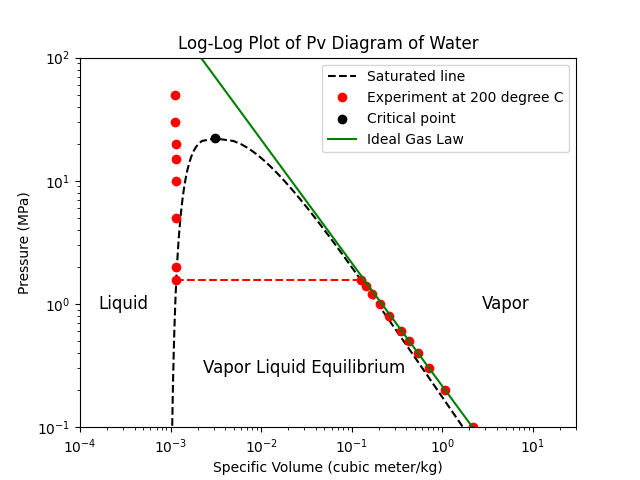
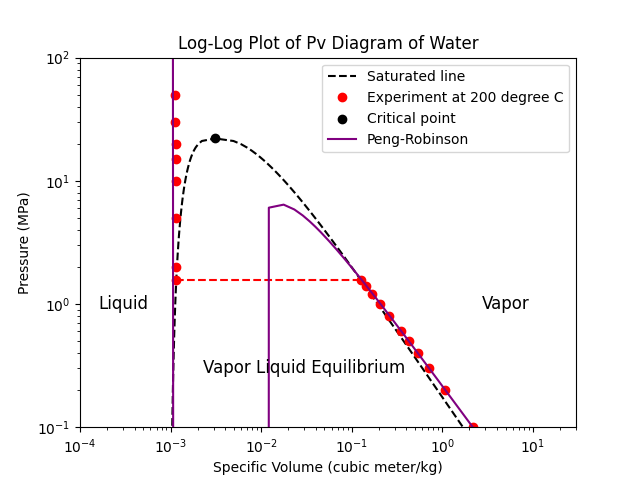
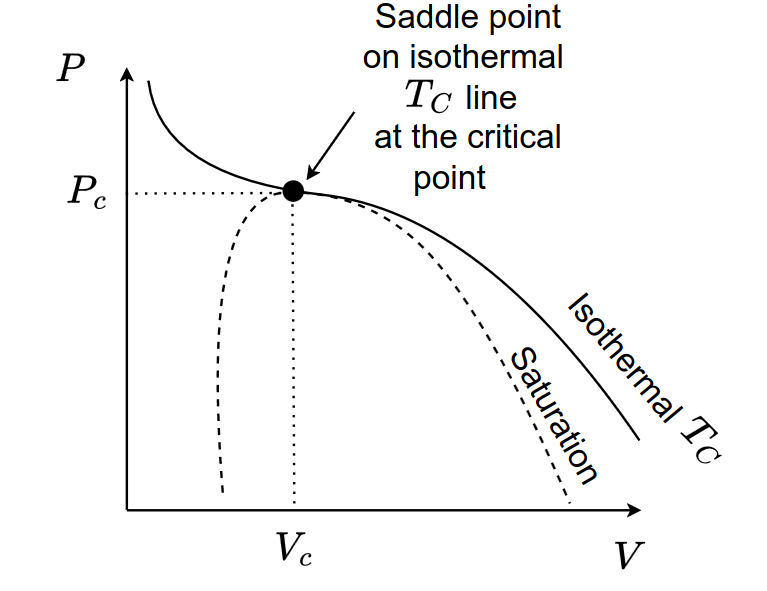

## Learning objectives

By the end of this lecture, students should be able to:

* Explain how equations of state are used to relate $P$, $v$, and $T$ for pure components.
* Describe the role of cubic equations of state in modeling real-fluid properties.
* Calculate pure-component thermodynamic properties such as $h$, $s$, and $g$ using ideal-gas and residual-property methods.

---

## Thermodynamic Methods for Pure Components

Thermodynamic methods are the tools we use to calculate thermodynamic properties and phase-equilibrium behavior from equations of state and property models.

In this section, we begin with **pure components**. This provides the foundation for understanding thermodynamic methods before extending them to mixtures.

For a pure component, the thermodynamic state can be described using two independent properties. For example, if temperature and pressure are chosen as the independent variables, a thermodynamic property can be written as

$$
X = X(T,P)
$$

where $X$ may represent properties such as molar volume, enthalpy, entropy, internal energy, or Gibbs free energy.

Therefore, if we know the temperature $T$, the pressure $P$, and the relationship between these variables and the property of interest, we can calculate the thermodynamic property $X$ for the system.

In process simulation, a thermodynamic method commonly combines two main components: an **equation of state** and **thermodynamic property models**.

An **equation of state** describes the relationship between measurable properties such as temperature, pressure, and volume. For example, an equation of state can be used to calculate the molar volume of a fluid from known temperature and pressure.

**Thermodynamic property models** are then used to calculate other properties, such as internal energy, enthalpy, entropy, and Gibbs free energy. These models may be based on property correlations, departure functions, or other thermodynamic relationships.

Together, the equation of state and thermodynamic property models form what we will call a **thermodynamic method** in this course.

In other words, a thermodynamic method provides a systematic way to calculate thermodynamic properties from known process conditions.

## Equations of State

An **equation of state** (EOS) is a mathematical relationship between pressure $P$, molar volume $v$, and temperature $T$. It describes how these measurable properties are related for a given substance.

An equation of state can be written in different forms. For example, it may be written as a volume-explicit equation,

$$
v = f(T,P)
$$

or as a pressure-explicit equation,

$$
P = f(T,v)
$$

Both forms describe the same physical relationship, but they may be more or less convenient depending on the calculation.

## Ideal-Gas Law

The simplest equation of state is the **ideal-gas law**:

$$
PV = n_TRT
$$

or, in terms of molar volume,

$$
Pv = RT
$$

where $n_T$ is the total number of moles and

$$
v = \frac{V}{n_T}
$$

is the molar volume.

The ideal-gas model is based on two simplifying assumptions:

* Gas molecules occupy negligible volume compared with the volume of the container.
* There are no intermolecular forces between gas molecules.

Under these assumptions, the ideal-gas equation provides a simple relationship between $P$, $v$, and $T$.

Once $P$, $v$, and $T$ are related through an equation of state, other thermodynamic properties can be calculated using appropriate thermodynamic relationships.

:::{.callout-note}

## Conditions for Ideal-Gas Behavior

<details>
<summary>Show answer</summary>

You may be surprised that the ideal-gas law is a good approximation for many gases under low pressures (including atmospheric pressure!) and high temperatures.

At low pressures, the gas molecules are far apart, so their finite volume and intermolecular forces have minimal effect on the overall behavior of the gas. 

At high temperatures, the kinetic energy of the molecules is much greater than the potential energy from intermolecular forces, so these forces can be neglected.

Both of these conditions lead to behavior that closely follows the ideal-gas law, making it a useful model for many practical applications in process simulation.
</details>
:::

## Real-Fluid Models

Real fluids do not always behave like ideal gases. Molecules occupy finite volume, and they interact with one another through attractive and repulsive forces.

To measure the deviation from ideal-gas behavior, we introduce the **compressibility factor**:

$$
Z = \frac{Pv}{RT}
$$

For an ideal gas,

$$
Z = 1
$$

At a given temperature and pressure, the compressibility factor can also be interpreted as

$$
Z = \left. \frac{v}{v^{\mathrm{id}}} \right|_{T,P}
$$

where $v^{\mathrm{id}}$ is the molar volume predicted by the ideal-gas equation at the same temperature and pressure.

Therefore, $Z$ compares the actual molar volume of a real fluid with the molar volume that the fluid would have if it behaved as an ideal gas.

Common equations of state used to model real fluids include:

* **Virial equations of state**, which are useful for gases at low to moderate pressures.
* **Cubic equations of state**, which are widely used in process simulation because they can represent vapor-liquid equilibrium and critical behavior.

In this course, we will focus mainly on **cubic equations of state**, since they are practical, widely used, and suitable for many process-simulation calculations.

## Cubic Equations of State

Cubic equations of state are important in process simulation because they can describe both liquid and vapor phases using a single equation. They can also represent vapor-liquid equilibrium, the two-phase region, and critical behavior.

::: {.callout-note}

## Why are they called “cubic”?

<details>
<summary>Show answer</summary>

Cubic equations of state are called **cubic** because they can be rearranged into a cubic polynomial in the molar volume (v):

$$
v^3 + \delta v^2 + \varepsilon v + \zeta = 0.
$$

Because this is a third-degree polynomial, it can have up to three real roots. In the two-phase region, these roots are typically interpreted as the molar volume of the liquid phase, the molar volume of the vapor phase, and one intermediate root that is not physically stable.

</details>
:::

Compared with the ideal-gas equation of state, cubic equations of state include corrections for real-fluid behavior. These corrections account for the finite size of molecules and the attractive forces between them.

::: {#fig-water-eos layout-ncol=2}

{#fig-water-idg}

{#fig-water-pr}

Comparison of water behaviour predicted by the ideal-gas model and the Peng--Robinson cubic EOS.
:::

A general cubic equation of state can be written in terms of the compressibility factor as

$$
Z = \frac{v}{v-b} - \frac{\Theta v}{\left(v^2 + \delta v + \varepsilon\right)RT}
$$

or in pressure-explicit form as

$$
P = \underbrace{\frac{RT}{v-b}}_{\text{repulsive term}} - \underbrace{\frac{\Theta}{v^2 + \delta v + \varepsilon}}_{\text{attractive term}}
$$

where $b$, $\Theta$, $\delta$, and $\varepsilon$ are equation-of-state parameters.

The first term represents the **repulsive contribution**. It accounts for the finite volume occupied by molecules. This effect is often called the excluded-volume or hard-core repulsion effect and is mainly represented by the parameter $b$.

The second term represents the **attractive contribution**. It accounts for the cohesive forces between molecules and is represented through the parameters $\Theta$, $\delta$, and $\varepsilon$.

Different cubic equations of state are obtained by choosing different forms for these parameters. Common examples include:

::: {style="width:70%; margin:auto;"}

| Equation | $\Theta$ | $\delta$ | $\varepsilon$ |
|---|---:|---:|---:|
| van der Waals | $a$ | $0$ | $0$ |
| Redlich-Kwong | $a/\sqrt{T}$ | $b$ | $0$ |
| Soave-Redlich-Kwong | $a(T)$ | $b$ | $0$ |
| Peng-Robinson | $a(T)$ | $2b$ | $-b^2$ |

:::

In this course, we will focus mainly on the **Soave-Redlich-Kwong** and **Peng-Robinson** equations of state because they are widely used in chemical engineering calculations, especially for vapor-liquid equilibrium and process simulation.

### $a$ and $b$ Parameters

In cubic equations of state, the parameters $a$ and $b$ are used to represent the attractive and repulsive contributions, respectively. One can obtainen these parameters by fitting the equation of state to experimental data.

#### Interactive Activity: Fitting the Redlich--Kwong Cubic EOS

In this activity, we compare water $P$-$v$ data at $200^\circ\mathrm{C}$ and $300^\circ\mathrm{C}$ with the Redlich--Kwong equation of state:

$$
P = \frac{RT}{v-b}
-
\frac{a}{\sqrt{T}\,v(v+b)}
$$

Here, $T$ is the temperature, $a$ controls the attractive contribution, and $b$ controls the repulsive or excluded-volume contribution.

Your goal is to adjust $T$, $a$, and $b$ to make the predicted curve match the experimental data of the selected temperature.

```{ojs}
//| echo: false

// Specific gas constant for water
// R = 0.4615 kPa m^3/(kg K)
//   = 0.0004615 MPa m^3/(kg K)
R = 0.0004615
```

```{ojs}
//| echo: false

viewof T_C = Inputs.select(
  [200, 300],
  {
    value: 200,
    label: "Temperature, T [°C]"
  }
)
```

```{ojs}
//| echo: false

T = T_C + 273.15
```

```{ojs}
//| echo: false

viewof a = Inputs.range(
  [0.020, 0.070],
  {
    value: 0.04395,
    step: 0.0001,
    label: "Attractive parameter, a [MPa m⁶ K¹ᐟ²/kg²]"
  }
)
```

```{ojs}
//| echo: false

viewof b = Inputs.range(
  [0.0007, 0.0016],
  {
    value: 0.00117,
    step: 0.00001,
    label: "Repulsive parameter, b [m³/kg]"
  }
)
```

```{ojs}
//| echo: false

P_RK = v => {
  return R*T/(v - b) - a/(Math.sqrt(T)*v*(v + b))
}
```

```{ojs}
//| echo: false

// Approximate water P-v data at 200 C
waterData200 = [
  {Tlabel: "200 C", region: "Compressed liquid", v: 0.00116, P: 100},
  {Tlabel: "200 C", region: "Compressed liquid", v: 0.00115, P: 50},
  {Tlabel: "200 C", region: "Compressed liquid", v: 0.00114, P: 20},
  {Tlabel: "200 C", region: "Compressed liquid", v: 0.00116, P: 10},
  {Tlabel: "200 C", region: "Compressed liquid", v: 0.00116, P: 5},

  {Tlabel: "200 C", region: "Saturated liquid", v: 0.001157, P: 1.5549},
  {Tlabel: "200 C", region: "Saturated vapor", v: 0.1274, P: 1.5549},

  {Tlabel: "200 C", region: "Superheated vapor", v: 0.132, P: 1.5},
  {Tlabel: "200 C", region: "Superheated vapor", v: 0.206, P: 1.0},
  {Tlabel: "200 C", region: "Superheated vapor", v: 0.425, P: 0.5},
  {Tlabel: "200 C", region: "Superheated vapor", v: 1.080, P: 0.2},
  {Tlabel: "200 C", region: "Superheated vapor", v: 2.172, P: 0.1},
  {Tlabel: "200 C", region: "Superheated vapor", v: 4.36, P: 0.05}
]
```

```{ojs}
//| echo: false

// Approximate water P-v data at 300 C
waterData300 = [
  {Tlabel: "300 C", region: "Compressed liquid", v: 0.00138, P: 100},
  {Tlabel: "300 C", region: "Compressed liquid", v: 0.00139, P: 50},
  {Tlabel: "300 C", region: "Compressed liquid", v: 0.00140, P: 20},
  {Tlabel: "300 C", region: "Compressed liquid", v: 0.00140, P: 10},

  {Tlabel: "300 C", region: "Saturated liquid", v: 0.001404, P: 8.588},
  {Tlabel: "300 C", region: "Saturated vapor", v: 0.0217, P: 8.588},

  {Tlabel: "300 C", region: "Superheated vapor", v: 0.026, P: 8.0},
  {Tlabel: "300 C", region: "Superheated vapor", v: 0.045, P: 5.0},
  {Tlabel: "300 C", region: "Superheated vapor", v: 0.132, P: 2.0},
  {Tlabel: "300 C", region: "Superheated vapor", v: 0.265, P: 1.0},
  {Tlabel: "300 C", region: "Superheated vapor", v: 0.529, P: 0.5},
  {Tlabel: "300 C", region: "Superheated vapor", v: 1.323, P: 0.2}
]

waterData = waterData200.concat(waterData300)
```

```{ojs}
//| echo: false

// Approximate saturation dome for water
satLiquid = [
  {T: 100, P: 0.1013, v: 0.001043},
  {T: 120, P: 0.1985, v: 0.001060},
  {T: 140, P: 0.3615, v: 0.001080},
  {T: 160, P: 0.6182, v: 0.001102},
  {T: 180, P: 1.002,  v: 0.001127},
  {T: 200, P: 1.5549, v: 0.001157},
  {T: 220, P: 2.320,  v: 0.001190},
  {T: 240, P: 3.345,  v: 0.001229},
  {T: 260, P: 4.692,  v: 0.001276},
  {T: 280, P: 6.418,  v: 0.001333},
  {T: 300, P: 8.588,  v: 0.001404},
  {T: 320, P: 11.28,  v: 0.001499},
  {T: 340, P: 14.60,  v: 0.001638},
  {T: 360, P: 18.67,  v: 0.001895},
  {T: 374, P: 22.064, v: 0.003106}
]

satVapor = [
  {T: 100, P: 0.1013, v: 1.694},
  {T: 120, P: 0.1985, v: 0.8919},
  {T: 140, P: 0.3615, v: 0.5089},
  {T: 160, P: 0.6182, v: 0.3068},
  {T: 180, P: 1.002,  v: 0.1941},
  {T: 200, P: 1.5549, v: 0.1274},
  {T: 220, P: 2.320,  v: 0.0861},
  {T: 240, P: 3.345,  v: 0.0602},
  {T: 260, P: 4.692,  v: 0.0434},
  {T: 280, P: 6.418,  v: 0.0317},
  {T: 300, P: 8.588,  v: 0.0217},
  {T: 320, P: 11.28,  v: 0.0155},
  {T: 340, P: 14.60,  v: 0.0108},
  {T: 360, P: 18.67,  v: 0.00695},
  {T: 374, P: 22.064, v: 0.003106}
]
```

```{ojs}
//| echo: false

satLine200 = [
  {v: 0.001157, P: 1.5549},
  {v: 0.1274, P: 1.5549}
]

satLine300 = [
  {v: 0.001404, P: 8.588},
  {v: 0.0217, P: 8.588}
]
```

```{ojs}
//| echo: false

// Generate predicted EOS curve.
// The curve is split to avoid numerical issues near v = b.

liquidBranch = Array.from({length: 2500}, (_, i) => {
  const logMin = Math.log10(Math.max(1.01*b, 8e-4))
  const logMax = Math.log10(0.02)
  const v = Math.pow(10, logMin + i*(logMax - logMin)/2499)
  return {v: v, P: P_RK(v)}
}).filter(d => d.P > 0.01 && d.P < 120 && Number.isFinite(d.P))

vaporBranch = Array.from({length: 2500}, (_, i) => {
  const logMin = Math.log10(0.02)
  const logMax = Math.log10(20)
  const v = Math.pow(10, logMin + i*(logMax - logMin)/2499)
  return {v: v, P: P_RK(v)}
}).filter(d => d.P > 0.01 && d.P < 120 && Number.isFinite(d.P))
```

```{ojs}
//| echo: false

Plot.plot({
  width: 900,
  height: 650,
  grid: true,
  x: {
    type: "log",
    label: "Specific volume, v [m³/kg]",
    domain: [8e-4, 20]
  },
  y: {
    type: "log",
    label: "Pressure, P [MPa]",
    domain: [0.01, 120]
  },
  marks: [
    // Saturation dome
    Plot.line(satLiquid, {
      x: "v",
      y: "P",
      stroke: "black",
      strokeDasharray: "5,4",
      strokeWidth: 1.5
    }),

    Plot.line(satVapor, {
      x: "v",
      y: "P",
      stroke: "black",
      strokeDasharray: "5,4",
      strokeWidth: 1.5
    }),

    // 200 C saturation line
    Plot.line(satLine200, {
      x: "v",
      y: "P",
      stroke: "red",
      strokeDasharray: "6,4",
      strokeWidth: 2
    }),

    // 300 C saturation line
    Plot.line(satLine300, {
      x: "v",
      y: "P",
      stroke: "blue",
      strokeDasharray: "6,4",
      strokeWidth: 2
    }),

    // Redlich--Kwong prediction
    Plot.line(liquidBranch, {
      x: "v",
      y: "P",
      stroke: "purple",
      strokeWidth: 2.5
    }),

    Plot.line(vaporBranch, {
      x: "v",
      y: "P",
      stroke: "purple",
      strokeWidth: 2.5
    }),

    // 200 C data
    Plot.dot(waterData200, {
      x: "v",
      y: "P",
      r: 5,
      stroke: "black",
      fill: "red",
      title: d => `200 C ${d.region}: P = ${d.P} MPa, v = ${d.v} m³/kg`
    }),

    // 300 C data
    Plot.dot(waterData300, {
      x: "v",
      y: "P",
      r: 5,
      stroke: "black",
      fill: "blue",
      title: d => `300 C ${d.region}: P = ${d.P} MPa, v = ${d.v} m³/kg`
    }),

    // Critical point
    Plot.dot([{v: 0.003106, P: 22.064}], {
      x: "v",
      y: "P",
      r: 5,
      fill: "black",
      title: "Critical point"
    }),

    // Main labels
    Plot.text([{x: 0.006, y: 60, label: "Redlich--Kwong prediction"}], {
      x: "x",
      y: "y",
      text: "label",
      fill: "purple",
      fontSize: 13,
      fontWeight: "bold"
    }),

    Plot.text([{x: 0.025, y: 2.0, label: "200°C saturation line"}], {
      x: "x",
      y: "y",
      text: "label",
      fill: "red",
      fontSize: 12
    }),

    Plot.text([{x: 0.004, y: 10.5, label: "300°C saturation line"}], {
      x: "x",
      y: "y",
      text: "label",
      fill: "blue",
      fontSize: 12
    }),

    Plot.text([{x: 0.00105, y: 0.03, label: "Liquid region"}], {
      x: "x",
      y: "y",
      text: "label",
      dx: 10,
      fontSize: 12
    }),

    Plot.text([{x: 0.025, y: 0.08, label: "Vapor-liquid region"}], {
      x: "x",
      y: "y",
      text: "label",
      fontSize: 12
    }),

    Plot.text([{x: 2.0, y: 0.3, label: "Vapor region"}], {
      x: "x",
      y: "y",
      text: "label",
      fontSize: 12
    }),

    Plot.text([{x: 0.006, y: 25, label: "Critical point"}], {
      x: "x",
      y: "y",
      text: "label",
      fontSize: 12
    }),

    Plot.text([{x: 0.0022, y: 0.55, label: "Saturation dome"}], {
      x: "x",
      y: "y",
      text: "label",
      fontSize: 12
    }),

    // Manual legend
    Plot.text([{x: 5.0, y: 50, label: "● 200°C data"}], {
      x: "x",
      y: "y",
      text: "label",
      fill: "red",
      fontSize: 13
    }),

    Plot.text([{x: 5.0, y: 30, label: "● 300°C data"}], {
      x: "x",
      y: "y",
      text: "label",
      fill: "blue",
      fontSize: 13
    }),

    Plot.text([{x: 5.0, y: 18, label: "− RK EOS"}], {
      x: "x",
      y: "y",
      text: "label",
      fill: "purple",
      fontSize: 13
    }),

    Plot.text([{x: 5.0, y: 11, label: "-- VLE dome"}], {
      x: "x",
      y: "y",
      text: "label",
      fill: "black",
      fontSize: 13
    })
  ]
})
```
::: {.callout-note}
## Solution to the Interactive Activity

<details>
<summary>Show answer</summary>
This exercise is meant to be exploratory, so there is no single correct answer. However, you should find that the following values of $a$ and $b$ give a reasonable fit to the data from both temperatures. 
</details>
:::

Above exercise could show how difficult it is to fit a simple cubic equation of state to real-fluid data. To generalize the method, the critical properties of the fluid are often used to calculate these EOS parameters.

### Critical-Point Conditions

To understand how the parameters in a cubic equation of state are obtained, we first need to look at the behavior of a pure fluid near its **critical point**.

For a pure substance, typical $P$–$v$ isotherms change shape as temperature increases. At temperatures below the critical temperature, the fluid can exist as two distinct phases: liquid and vapor. At the critical temperature, however, the distinction between liquid and vapor disappears.

The critical point is defined by the critical temperature, critical pressure, and critical molar volume:

$$
(T_c, P_c, v_c)
$$

At this point, the critical isotherm has a **horizontal inflection point**. This means that both the slope and the curvature of the $P$–$v$ curve are zero at the critical point.

{#fig-critical-point width="60%" fig-align="center"}

For a pure component described by an equation of state,

$$
P = P(T,v)
$$

the critical-point conditions are

$$
\left(\frac{\partial P}{\partial v}\right)_{T_c} = 0
$$

and

$$
\left(\frac{\partial^2 P}{\partial v^2}\right)_{T_c} = 0
$$

The first condition states that the isotherm is locally flat at the critical point. The second condition states that the curvature also vanishes at this point.

Together, these two conditions provide a mathematical definition of the critical point on a $P$–$v$ diagram. They are also useful because they allow us to relate the parameters in an equation of state to measurable critical properties.

### Application to the Redlich--Kwong Equation

The Redlich--Kwong equation of state is

$$
P =
\frac{RT}{v-b}
-
\frac{a}{\sqrt{T}v(v+b)}
$$

where $a$ represents the attractive contribution and $b$ represents the repulsive or excluded-volume contribution.

To determine $a$ and $b$, we apply the critical-point conditions to the Redlich--Kwong equation:

$$
\left(\frac{\partial P}{\partial v}\right)_{T_c} = 0
$$

and

$$
\left(\frac{\partial^2 P}{\partial v^2}\right)_{T_c} = 0
$$

Solving these equations gives the Redlich--Kwong parameter correlations:

$$
a
=
\frac{R^2 T_c^{5/2}}
{9\left(2^{1/3}-1\right)P_c}
$$

or approximately,

$$
a
\approx
0.42748
\frac{R^2 T_c^{5/2}}{P_c}
$$

and

$$
b
=
\frac{1}{3}
\left(2^{1/3}-1\right)
\frac{RT_c}{P_c}
$$

or approximately,

$$
b
\approx
0.08664
\frac{RT_c}{P_c}
$$

Therefore, for a pure component, the Redlich--Kwong parameters can be estimated using only the critical temperature and critical pressure.

This is an important result. It means that we can construct an equation of state even when detailed experimental $P$–$v$ data are not available.

### Example: Redlich--Kwong Parameters for Water

For water, the critical properties are approximately

$$
T_c = 647.1 \ \mathrm{K}
$$

and

$$
P_c = 22.064 \ \mathrm{MPa}
$$

Using these values in the Redlich--Kwong parameter correlations gives

$$
a
\approx
0.04395
\ \mathrm{MPa \, m^6 \, K^{1/2}/kg^2}
$$

and

$$
b
\approx
0.00117
\ \mathrm{m^3/kg}
$$

These values can be used as the default values in the interactive Redlich--Kwong activity.

Try these values in the interactive plot and compare the prediction with the experimental $P$–$v$ data at $200^\circ\mathrm{C}$ and $300^\circ\mathrm{C}$. You should observe that the Redlich--Kwong equation captures the general trend of the data, especially in the vapor region, but it does not describe the liquid region very accurately.

This limitation is expected. The Redlich--Kwong equation works best for relatively simple, nearly spherical, nonpolar molecules, such as noble gases. For highly polar or associating substances, such as water and alcohols, the predictions are less accurate because these fluids have strong intermolecular interactions that are not fully captured by the simple RK form.


